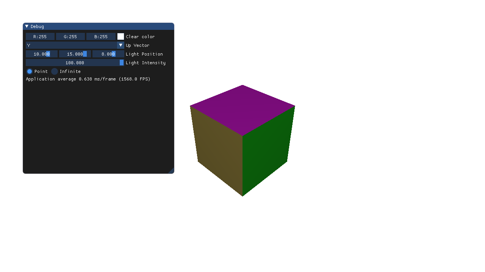



# NVIDIA Vulkan Ray Tracing Tutorial

This example is a simple OBJ viewer in Vulkan, without any ray tracing functionality. iT is the starting point of the [`ray tracing tutorial`](../ray_tracing__simple), the source of the application in which ray tracing will be added.

Before starting the [`tutorial`](../ray_tracing__simple), understanding the current example will help understanding how to add the components needed for ray tracing.

## Environment Setup

Clone or download the following repositories:

* [shared_sources](https://github.com/nvpro-samples/shared_sources): The primary framework that all samples depend on.
* [shared_external](https://github.com/nvpro-samples/shared_external): Third party libraries that are provided pre-compiled, mostly for Windows x64 / MSVC.

The repository should be looking like:

```bash
-
|- shared_sources
|- shared_external
|- vk_raytracing_tutorial
  |- ray_tracing__before (this one)
```



